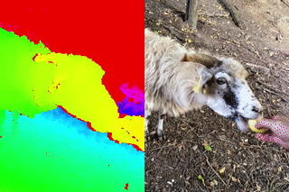

# <a href="https://record3d.app">Record3D</a> simple Wi-Fi Streaming demo
***Be sure to check out also <a href="https://marek-simonik.github.io/record3d-wifi-streaming-and-rgbd-mp4-3d-video-demo/" target="_blank">the Three.js 3D Video demo</a>! It allows you live stream 3D Videos via Wi-Fi and also to replay offline mp4 RGBD Videos.***

This is a trivial demo (minimal working example), which demonstrates how to setup a basic RGBD Video streaming session using <a href="https://record3d.app" target="_blank">Record3D</a>. Note that Wi-Fi Streaming is a part of the **paid Wi-Fi Streaming & RGBD video export Extension Pack**.

The video is streamed via **WebRTC** from your iPhone/iPad (let's call it *iDevice* from now on) into your web browser. It is recommended that you try the demo in Google Chrome or in Safari. You may experience issues in Firefox.

Here you can see how a streamed RGBD video might look like:

## 1. How to try the demo

1. Open the <a href="https://record3d.app" target="_blank">Record3D app</a> on your iDevice.
1. Go to the Settings tab > Live RGBD Video Streaming > select Wi-Fi.
1. Switch back to the Record tab, connect to your Wi-Fi network and tap the red round button. You should see "*Started, Waiting for Connection*".
1. Obtain an IP address of your iDevice (e.g. `192.168.1.100`) or its mDNS address (e.g. `myiPhone.local`). You should see the IP address(es) and the mDNS address listed above the red round button ("*Device Addresses*"). If you won't see them, then go to the iOS Settings app and get your local Wi-Fi IP address. 
1. Open this demo on your computer (or another iDevice), which is connected to the same Wi-Fi network. Alternatively, you can see this demo by visiting `http://<your-iDevice-address>/`.
1. Then enter your iDevice's address into the input field and hit the `Press to start streaming` button. Now you should see the live stream appear.

### 1.1 Disclaimer
Note that the video resolution and its quality depend highly on your Wi-Fi speed. If you have low bandwidth, both the *video resolution and its quality will decrease* to facilitate real-time streaming without severe delays. This will cause loss of depth accuracy and more noise.

I do not recommend to use Wi-Fi streaming if you require low noise and accurate depth data; Wi-Fi streaming is primarily meant for entertainment purposes. If accuracy is required, you should instead use the <a href="https://github.com/marek-simonik/record3d" target="_blank">USB Streaming option</a>. 

The streamed RGBD Video currently does not contain audio. The exported mp4 does include audio though.

## 2. Technical details

### 2.1 Connection
Only one peer can receive the RGBD stream at once. Once a peer (e.g. your browser) connects to your iDevice and streaming begins, nobody else can receive the streamed video. In order to let another peer (e.g. a browser on a different computer) receive the RGBD stream, the current peer will need to disconnect to allow another peer to connect. 

Once you tap the red round button in Record3D (while in Wi-Fi Streaming mode), a server with the following JSON API will become active: 

- `http://<your-iDevice-address>/getOffer` — using this endpoint, you can request you iDevice's WebRTC offer, which can be set on the peer's side (e.g. in a browser on your PC). If someone has already connected to the iDevice and streaming is in progress, you will get HTTP Error 403. 
- `http://<your-iDevice-address>/sendAnswer` — once you generate WebRTC answer to your iDevice's WebRTC offer, you must send it to your iDevice. This is necessary for establishing live stream connection. 
- `http://<your-iDevice-address>/metadata` — this endpoint provides metadata about the streamed video, such as the intrinsic matrix (`K`).

See `index.html` for better understanding of how the API works.

If you experience issues with connection, then you can try turning the Wi-Fi Streaming on and off (by pressing the red round button).

### 2.2 RGBD Video Format
> Both Wi-Fi Streaming and RGBD mp4 Video Export convert 3D Videos into the same format as you can see in the video above.
Note that the RGBD Video does not replace USB Streaming or export into the .r3d format. People who need the most accurate depth data should still use USB streaming and .r3d.

In the right half of the RGBD video, there is the color component of the RGBD frame. In the left half of the video, there is the corresponding depth map encoded into HSV color image.

The colors represent depth values in the range from **0 to 3 meters**. Invalid depth values or depth values outside of this range are mapped to the maximum depth value (3 meters). Such values appear red in the HSV-encoded depth map (as you can see above).
To decode the HSV-encoded depth map, you will need to do the following:

1. Convert the RGB values into HSV so that the Hue, Saturation and Value components are each in the range 0–1 (including the Hue component).
1. Take the Hue component (which is in the 0–1 range) and convert it into floating point depth: `depth_value_in_meters = 3.0 * hue_component`.

The exported mp4 RGBD videos contain the intrinsic matrix in a form of JSON in metadata of the mp4 container. If this is too complicated or impractical for you to access, then you can copy the `metadata.json` file which is generated alongside the .mp4 video.

Due to lossy mp4 compression, the restored depth map will almost always be of worse quality compared to the uncompressed original. 
